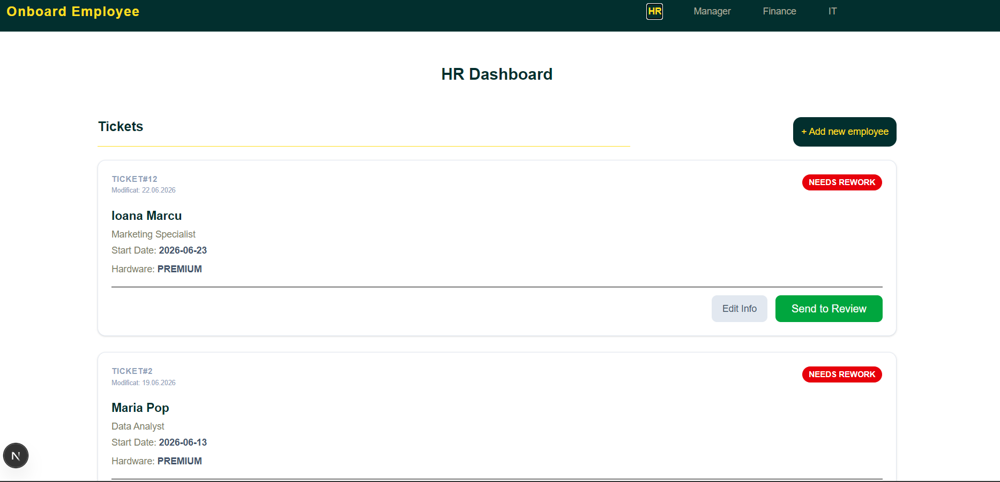

# Employee Onboarding System

This project is a full-stack web application developed to automate the employee onboarding lifecycle. It replaces manual, chaotic processes with a structured workflow that synchronizes HR, IT, and Management departments.

The application manages the entire journey of a new hire, ensuring that specific stages—such as manager reviews, finance approvals for hardware, and IT provisioning—are tracked and completed efficiently. The system also includes a rejection loop, allowing requests to be sent back to HR for rework.

## Technology Stack

- Backend: Java (Custom HTTP server with API handlers).
- Frontend: Next.js (React).
- Database: PostgreSQL.
- Security: BCrypt for password hashing.

## Operational Workflow

The system strictly enforces the onboarding lifecycle as defined in the technical specifications: 
- Initiation: HR submission of employee profiles, including role specifications and hardware requirements.
- Manager Review: Verification and approval of the generated Job Description.
- Conditional Finance Approval: Automated routing to Finance for "Premium" hardware tiers, while "Standard" requests bypass this stage.
- IT Provisioning: Account creation and hardware configuration.
- Completion: Final validation of all departmental tasks.
- Rejection Loop: A robust feedback mechanism allowing for request rejection and "Needs Rework" status, enabling HR to edit and resubmit profiles.

### Dashboard Overview 



## Getting Started

To initialize the development environment, execute the following steps:

1. Backend Services: Compile and execute App.java to initialize the API server.

2. Frontend Application: Navigate to the project root in your terminal and execute:
```bash
npm run dev
```
3. Access: The application will be available at http://localhost:3000.
